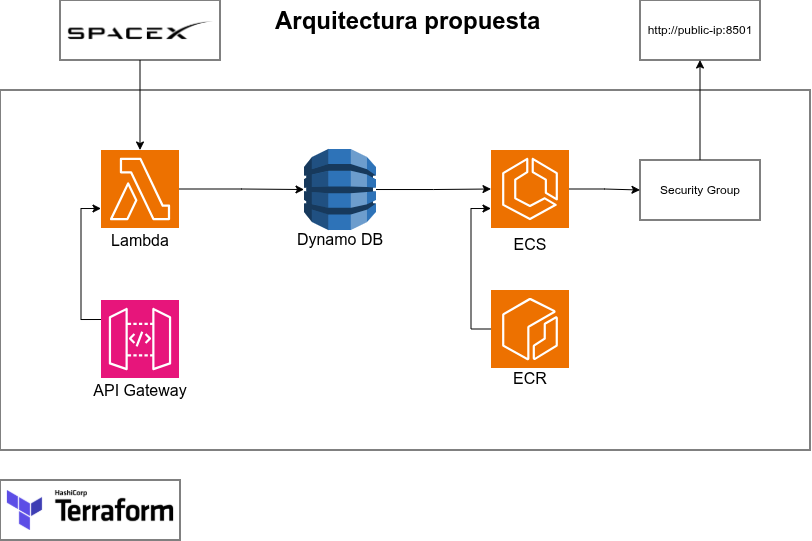

# Solución Propuesta

## Resumen Ejecutivo

**Jelambrar96X** es una solución completa e integrada que automatiza la extracción, procesamiento y visualización de datos de lanzamientos espaciales de SpaceX. Implementa una arquitectura **serverless** en AWS, donde cada componente (Lambda, DynamoDB, Fargate, VPC) está definido como código mediante **Terraform**, permitiendo reproducibilidad, versionado y escalabilidad horizontal.

## Componentes Principales

La solución está compuesta por 5 capas fundamentales:

```
┌─────────────────────────────────────────┐
│  SpaceX API (Datos en Tiempo Real)      │
└──────────────┬──────────────────────────┘
               │
┌──────────────▼──────────────────────────┐
│  AWS Lambda (Extracción & ETL)          │
│  - EventBridge (Scheduling)             │
│  - API Gateway (Manual Trigger)         │
└──────────────┬──────────────────────────┘
               │
┌──────────────▼──────────────────────────┐
│  Amazon DynamoDB (Almacenamiento)       │
│  - PAY_PER_REQUEST (serverless)         │
│  - Point-in-Time Recovery (PITR)        │
└──────────────┬──────────────────────────┘
               │
┌──────────────▼──────────────────────────┐
│  Streamlit Dashboard (Visualización)    │
│  - Containerizado en ECS Fargate        │
│  - Almacenado en Amazon ECR             │
└──────────────┬──────────────────────────┘
               │
┌──────────────▼──────────────────────────┐
│  Amazon VPC (Red Privada & Seguridad)   │
│  - Subnets públicas/privadas            │
│  - NAT Gateway & Security Groups        │
└─────────────────────────────────────────┘
```

### 1. Fuente de Datos: SpaceX API
- **Endpoint**: `https://api.spacexdata.com/v5/launches/query`
- **Tipo de datos**: Lanzamientos espaciales (activos, próximos, históricos)
- **Frecuencia de ingesta**: 4 veces diarias (01:00, 07:00, 13:00, 19:00 UTC) + manual bajo demanda
- **Protocolo**: POST con filtros por rango de fecha

### 2. Procesamiento: AWS Lambda
- **Lenguaje**: Python 3.12
- **Responsabilidades**: Extracción, validación, transformación ETL, escritura a DynamoDB
- **Timeout**: 15 segundos (suficiente para 100+ registros)
- **Costos**: Paga por invocación + tiempo de ejecución (muy económico)

### 3. Almacenamiento: Amazon DynamoDB
- **Modelo**: NoSQL serverless con alta disponibilidad
- **Clave primaria**: ID de lanzamiento (partition key)
- **Sort key**: Fecha ISO8601 del lanzamiento
- **Escalabilidad**: Automática según demanda

### 4. Visualización: Streamlit + ECS Fargate
- **Dashboard interactivo** con gráficos Plotly
- **Consultas en tiempo real** a DynamoDB
- **Containerización**: Docker (Python 3.12)
- **Orquestación**: ECS Fargate (sin servers dedicados)

### 5. Red & Seguridad: Amazon VPC
- **VPC CIDR**: 10.0.0.0/16
- **Subnets públicas**: 2 (10.0.1.0/24, 10.0.2.0/24)
- **Subnets privadas**: 2 (10.0.10.0/24, 10.0.11.0/24)
- **Acceso a internet**: Internet Gateway + NAT Gateway
- **Seguridad**: Security groups con reglas explícitas




---

## Amazon DynamoDB: Configuración Detallada

### Esquema de la Tabla

```hcl
resource "aws_dynamodb_table" "spacex_launches" {
  name           = "spacex-dashboard-launches"
  billing_mode   = "PAY_PER_REQUEST"
  hash_key       = "id"              # Partition Key
  range_key      = "launch_date"    # Sort Key
  
  point_in_time_recovery {
    enabled = true
  }
}
```

### Claves Primarias

#### Partition Key: `id` (String)
- **Uso**: Identificador único de cada lanzamiento
- **Ejemplo**: `5eb87d04ffd86e000604b353`
- **Justificación**: Proporciona distribución pareja de datos; cada lanzamiento es único

#### Sort Key: `launch_date` (String, ISO8601)
- **Uso**: Ordenamiento y rango de consultas
- **Ejemplo**: `2017-06-23T19:10:00.000Z`
- **Justificación**: Permite consultas rápidas por rango de fechas (mes, año, período)
- **Tipo**: String (no number) para evitar problemas de conversión

### Configuración Operacional

| Parámetro | Valor | Razón |
|-----------|-------|-------|
| **Billing Mode** | PAY_PER_REQUEST | Serverless: paga solo por lo que usas |
| **PITR (Point-in-Time Recovery)** | Habilitado | Recuperación de punto en tiempo (backups automáticos) |
| **Encriptación** | AWS Owned Key | Encriptación en reposo + tránsito |
| **TTL (Time To Live)** | Deshabilitado | Mantener datos históricos indefinidamente |

### Índices

#### Global Secondary Index (GSI) - Disponible pero Comentado

```hcl
global_secondary_index {
  name            = "launch_date-gsi"
  hash_key        = "launch_date"    # Consultas por fecha
  range_key       = "id"
  projection_type = "ALL"
}
```

- **Uso**: Optimizar consultas que filtran por `launch_date` sin conocer `id`
- **Estado actual**: Comentado (tabla funciona sin él usando scans)
- **Cuándo activar**: Si las consultas por fecha se vuelven lenta (>1s en producción)

### Capacidad de Almacenamiento

- **Modo**: On-Demand (PAY_PER_REQUEST)
  - ✅ No hay overprovisioning
  - ✅ Escalable automáticamente
  - ✅ Ideal para cargas impredecibles
  - ✅ Estimado: $1.25 USD por millón de lecturas, $6.25 por millón de escrituras

### Ejemplo de Ítem Almacenado

```json
{
  "id": "5eb87d04ffd86e000604b353",
  "flight_number": 42,
  "mission_name": "BulgariaSat-1",
  "rocket_name": "5e9d0d95eda69973a809d1ec",
  "launch_date": "2017-06-23T19:10:00.000Z",
  "launch_date_precision": "hour",
  "launch_status": "success",
  "launchpad_id": "5e9e4502f509094188566f88",
  "crew": false,
  "capsules": false,
  "fairings_reused": false,
  "details": "Second time a booster will be reused..."
}
```

---

## AWS Lambda: Extracción y Transformación

### Rol IAM y Permisos

#### 1. Rol de Ejecución (`lambda_role`)

```hcl
resource "aws_iam_role" "lambda_role" {
  name = "spacex-dashboard_lambda_role"
  
  assume_role_policy = {
    Service = "lambda.amazonaws.com"
  }
}
```

**Propósito**: Permite que el servicio Lambda asuma el rol para ejecutar la función.

#### 2. Permisos de Logs (CloudWatch)

```hcl
resource "aws_iam_role_policy_attachment" "lambda_logs" {
  role       = aws_iam_role.lambda_role.name
  policy_arn = "arn:aws:iam::aws:policy/service-role/AWSLambdaBasicExecutionRole"
}
```

**Permisos incluidos**:
- `logs:CreateLogGroup`
- `logs:CreateLogStream`
- `logs:PutLogEvents`

**Beneficio**: Registra ejecuciones en CloudWatch Logs para debugging

#### 3. Permisos de DynamoDB (Custom Policy)

```hcl
data "aws_iam_policy_document" "lambda_dynamodb_access" {
  statement {
    actions = [
      "dynamodb:BatchWriteItem",    # Escritura por lotes
      "dynamodb:BatchGetItem",       # Lectura por lotes
      "dynamodb:PutItem",            # Insertar ítems individuales
      "dynamodb:GetItem",            # Obtener ítems individuales
      "dynamodb:Query",              # Consultas avanzadas
      "dynamodb:Scan",               # Escaneo de tabla completa
      "dynamodb:UpdateItem",         # Actualizar ítems
      "dynamodb:DeleteItem"          # Eliminar ítems
    ]
    resources = [
      var.dynamodb_table_arn,
      "${var.dynamodb_table_arn}/*"  # Incluye índices
    ]
  }
}
```

**Principio de Menor Privilegio (Least Privilege)**:
- Se otorgan solo los permisos necesarios
- Limitados a la tabla específica (no a toda DynamoDB)
- Incluye índices secundarios

**Justificación de cada permiso**:
| Permiso | Uso |
|---------|-----|
| `BatchWriteItem` | Escribir 100+ ítems eficientemente |
| `BatchGetItem` | Leer ítems en masa (para validaciones) |
| `PutItem` | Insertar lanzamientos individuales |
| `Query` | Buscar por rango de fecha (opcional) |
| `Scan` | Obtener todos los lanzamientos (opcional) |

### Función Lambda

#### Configuración Base

```hcl
resource "aws_lambda_function" "spacex_lambda" {
  function_name = "spacex-dashboard-fetcher"
  handler       = "app.lambda_handler"
  runtime       = "python3.12"
  role          = aws_iam_role.lambda_role.arn
  timeout       = 15  # segundos
  
  environment {
    variables = {
      DYNAMODB_TABLE = "spacex-dashboard-launches"
      ENVIRONMENT    = "dev"
    }
  }
}
```

#### Variables de Entorno

- `DYNAMODB_TABLE`: Nombre de la tabla donde escribir (inyectado por Terraform)
- `ENVIRONMENT`: Nivel de logging (dev/prod)

#### Lógica de Ejecución (app.py)

```python
def lambda_handler(event, context):
    # 1. Obtener parámetros de entrada (opcional)
    utc_date_str = event.get("utc_date")
    offset_seconds = event.get("offset_seconds", 6 * 3600)
    
    # 2. Calcular rango de fechas
    end_time = parser.isoparse(utc_date_str) if utc_date_str else datetime.now(timezone.utc)
    start_time = end_time - timedelta(seconds=offset_seconds)
    
    # 3. Consultar API de SpaceX
    payload = {
        "query": {
            "date_utc": {
                "$gte": start_time.isoformat(),
                "$lte": end_time.isoformat()
            }
        }
    }
    response = requests.post(URL, json=payload)
    data = response.json()
    
    # 4. Transformar cada lanzamiento
    dynamo_items = [launch_data(item) for item in data.get("docs", [])]
    
    # 5. Validar y escribir a DynamoDB
    dynamodb = boto3.resource("dynamodb")
    table = dynamodb.Table(os.environ["DYNAMODB_TABLE"])
    
    with table.batch_writer() as batch:
        for item in dynamo_items:
            batch.put_item(Item=item)
    
    # 6. Retornar resultado
    return {
        "statusCode": 200,
        "body": json.dumps({"inserted_items": len(dynamo_items)})
    }
```

---

## Triggers: Cómo se Dispara la Función

### Trigger 1: EventBridge (Scheduled - Automático)

#### Configuración

```hcl
resource "aws_cloudwatch_event_rule" "lambda_schedule" {
  name                = "spacex-dashboard-schedule"
  description         = "Trigger Lambda at 01:00, 07:00, 13:00, and 19:00 UTC"
  schedule_expression = "cron(0 1,7,13,19 * * ? *)"
}

resource "aws_cloudwatch_event_target" "lambda_target" {
  rule      = aws_cloudwatch_event_rule.lambda_schedule.name
  target_id = "SpaceXLambdaTarget"
  arn       = aws_lambda_function.spacex_lambda.arn
}

resource "aws_lambda_permission" "allow_eventbridge" {
  statement_id  = "AllowExecutionFromEventBridge"
  action        = "lambda:InvokeFunction"
  function_name = aws_lambda_function.spacex_lambda.function_name
  principal     = "events.amazonaws.com"
  source_arn    = aws_cloudwatch_event_rule.lambda_schedule.arn
}
```

#### Expresión Cron Explicada

```
cron(0 1,7,13,19 * * ? *)
     │ │ │ │  │ │  │
     │ │ │ │  │ │  └─ Day of week (? = any)
     │ │ │ │  │ └───── Month (*)
     │ │ │ │  └──────── Day of month (*)
     │ │ │ └─────────── Hours: 1, 7, 13, 19 UTC
     │ └─────────────── Minutes: 0
     └────────────────── Seconds: 0
```

**Horarios de Ejecución (UTC)**:
- 🌙 **01:00 UTC** - Madrugada Europea
- 🌅 **07:00 UTC** - Mañana Europea
- ☀️ **13:00 UTC** - Mediodía Europea
- 🌆 **19:00 UTC** - Atardecer Europeo

#### Beneficios

✅ Automatización sin intervención humana  
✅ Consistencia: siempre en los mismos horarios  
✅ Bajo costo: eventos sin latencia  
✅ Resiliencia: reintento automático si falla  

### Trigger 2: API Gateway (Manual - Bajo Demanda)

#### Configuración (En Terraform, módulo `lambda_iam`)

```hcl
# HTTP API Gateway v2
resource "aws_apigatewayv2_api" "spacex_api" {
  name          = "spacex-dashboard-api"
  protocol_type = "HTTP"
  
  cors_configuration {
    allow_origins = ["*"]
    allow_methods = ["POST"]
    allow_headers = ["content-type"]
  }
}

resource "aws_apigatewayv2_integration" "lambda_integration" {
  api_id           = aws_apigatewayv2_api.spacex_api.id
  integration_type = "AWS_PROXY"
  integration_uri  = aws_lambda_function.spacex_lambda.invoke_arn
}

resource "aws_apigatewayv2_route" "lambda_route" {
  api_id    = aws_apigatewayv2_api.spacex_api.id
  route_key = "POST /fetch"
  target    = "integrations/${aws_apigatewayv2_integration.lambda_integration.id}"
}

resource "aws_apigatewayv2_stage" "live" {
  api_id      = aws_apigatewayv2_api.spacex_api.id
  name        = "$default"
  auto_deploy = true
}

resource "aws_lambda_permission" "allow_apigateway" {
  statement_id  = "AllowExecutionFromAPIGateway"
  action        = "lambda:InvokeFunction"
  function_name = aws_lambda_function.spacex_lambda.function_name
  principal     = "apigateway.amazonaws.com"
  source_arn    = "${aws_apigatewayv2_api.spacex_api.execution_arn}/*/*"
}
```

#### Uso

**Endpoint**: `https://<api-id>.execute-api.us-east-1.amazonaws.com/fetch`

**Request (POST)**:
```bash
curl -X POST https://<api-id>.execute-api.us-east-1.amazonaws.com/fetch \
  -H "Content-Type: application/json" \
  -d '{
    "utc_date": "2025-11-27T12:00:00Z",
    "offset_seconds": 3600
  }'
```

**Response**:
```json
{
  "statusCode": 200,
  "body": "{\"inserted_items\": 5}"
}
```

#### Beneficios

✅ Invocación manual bajo demanda  
✅ Integración con aplicaciones externas  
✅ Testing durante desarrollo  
✅ Recuperación de datos históricos específicos  

---

## Flujo de Ejecución Completo

### Escenario: EventBridge Dispara Lambda a las 01:00 UTC

```
1. Reloj del Sistema
   └─ 01:00:00 UTC exactamente

2. EventBridge (CloudWatch Events)
   └─ Evaluá la regla: cron(0 1,7,13,19 * * ? *)
   └─ Coincide ✓

3. EventBridge → AWS Lambda
   └─ Verifica permiso: AllowExecutionFromEventBridge ✓
   └─ Invoca función: spacex-dashboard-fetcher

4. Lambda Inicia
   ├─ Asume rol: spacex-dashboard_lambda_role
   ├─ Carga variables de entorno:
   │  ├─ DYNAMODB_TABLE = "spacex-dashboard-launches"
   │  └─ ENVIRONMENT = "dev"
   └─ Ejecuta handler: app.lambda_handler(event, context)

5. Dentro de Lambda (app.py)
   ├─ event = {} (EventBridge no envía payload personalizado)
   ├─ Calcula rango: último 6 horas antes de 01:00
   ├─ POST a SpaceX API: https://api.spacexdata.com/v5/launches/query
   ├─ Recibe ~5-10 lanzamientos
   └─ Transforma cada registro:
      ├─ id: "5eb..." (string)
      ├─ mission_name: "BulgariaSat-1"
      ├─ launch_date: "2017-06-23T19:10:00Z" (ISO8601)
      ├─ launch_status: "success" (calculado)
      └─ ... otros 10+ campos

6. Lambda → DynamoDB
   ├─ Asume rol: Verifica permiso dynamodb:BatchWriteItem ✓
   ├─ Abre sesión batch_writer()
   ├─ Escribe 5-10 ítems
   └─ Cierra sesión (comit automático)

7. DynamoDB
   ├─ Almacena ítems en partition key: id
   ├─ Sort key: launch_date (ascendente)
   ├─ Indexa para consultas rápidas
   └─ Encripta en reposo

8. Lambda → Retorno
   ├─ Loguea en CloudWatch: "/aws/lambda/spacex-dashboard-fetcher"
   ├─ Retorna: {"statusCode": 200, "inserted_items": 7}
   └─ Detiene (15 segundos consumidos de los 15 máximos)

9. EventBridge Registra
   └─ Ejecución completada exitosamente ✓

10. Próxima Ejecución
    └─ 07:00 UTC (6 horas después)
```

---

## Arquitectura de Seguridad

### Roles IAM - Principio de Menor Privilegio

```
┌─────────────────────────────────────────┐
│        Lambda Function                  │
│  (spacex-dashboard-fetcher)             │
└──────────────┬──────────────────────────┘
               │
               └─ AssumeRole: lambda_role
                  │
                  ├─ Policy 1: AWSLambdaBasicExecutionRole
                  │  └─ Permisos: logs:CreateLogGroup, logs:PutLogEvents
                  │
                  └─ Policy 2: lambda_dynamodb_policy (Custom)
                     └─ Acciones: dynamodb:BatchWriteItem, dynamodb:Query, ...
                        └─ Recursos: arn:aws:dynamodb:*:account:table/spacex-*
```

### Security Groups (Networking)

- **Lambda**: Serverless, sin SG (acceso directo a DynamoDB)
- **Fargate**: SG que permite:
  - Inbound: puerto 8501 desde 0.0.0.0/0 (público)
  - Egress: todos los puertos a todos los destinos

- **DynamoDB**: Acceso restringido a Lambda + Fargate mediante IAM

---

## Recuperación y Durabilidad

### Point-in-Time Recovery (PITR)

```hcl
point_in_time_recovery {
  enabled = true
}
```

- **Ventana**: Últimos 35 días
- **Uso**: Recuperar tabla a cualquier segundo en ese período
- **Costo**: ~20% del costo de la tabla
- **Activación**: Manual en consola AWS o CLI

### Encriptación

- **En reposo**: AWS Owned Key (incluido, sin costo extra)
- **En tránsito**: TLS 1.2+ (SSL/HTTPS)
- **Cumplimiento**: HIPAA, PCI-DSS, SOC 2

---

## Monitoreo y Observabilidad

### CloudWatch Logs

```
Log Group: /aws/lambda/spacex-dashboard-fetcher
Log Stream: 2025/11/27/[$LATEST]abcdef123456

[INFO] Lambda started
[INFO] Fetching launches from SpaceX API
[DEBUG] Query: {"date_utc": {"$gte": "2025-11-27T00:00:00Z", "$lte": "2025-11-27T06:00:00Z"}}
[INFO] Received 7 launches from API
[INFO] Writing 7 items to DynamoDB
[INFO] Batch write completed successfully
[INFO] Lambda finished - Inserted 7 items in 2.5 seconds
```

### Métricas Key

| Métrica | Origen | Alerta |
|---------|--------|--------|
| Invocaciones Lambda | CloudWatch | > 10 errores en 5 min |
| Duración Lambda | CloudWatch | > 10 segundos |
| Errores DynamoDB | CloudWatch | Any ThrottlingException |
| Ítems insertados | Logs de Lambda | < 1 item (dato inusual) |

---


## Amazon ECR y ECS Fargate: Despliegue del Dashboard

### Visión General

El dashboard de Streamlit se despliega como un contenedor Docker en **Amazon ECS Fargate**, eliminando la necesidad de gestionar servidores. Las imágenes se almacenan en **Amazon ECR (Elastic Container Registry)**, un registro privado y seguro dentro de AWS.

```
┌──────────────────────────────────────┐
│    Docker Image (Streamlit)          │
│    - Python 3.12                     │
│    - Requirements.txt (dependencies) │
│    - Puerto 8501 expuesto            │
└──────────────┬───────────────────────┘
               │
               ▼
┌──────────────────────────────────────┐
│    Amazon ECR Registry               │
│    - spacex-dashboard-streamlit      │
│    - Latest tag (se actualiza)       │
│    - Privado (requiere credenciales) │
└──────────────┬───────────────────────┘
               │
               ▼
┌──────────────────────────────────────┐
│    Amazon ECS Cluster                │
│    - Fargate launch type             │
│    - Cluster: spacex-dashboard       │
└──────────────┬───────────────────────┘
               │
               ▼
┌──────────────────────────────────────┐
│    ECS Service                       │
│    - Desired count: 1 (scalable)     │
│    - Task definition                 │
│    - Load balancer (opcional)        │
└──────────────┬───────────────────────┘
               │
               ▼
┌──────────────────────────────────────┐
│    ECS Tasks (Contenedores)          │
│    - 1 instancia corriendo           │
│    - CPU: 512 (0.5 vCPU)            │
│    - Memoria: 1024 MB                │
│    - Port mapping: 8501              │
└──────────────────────────────────────┘
```

### Amazon ECR: Registro de Contenedores

#### Configuración en Terraform

```hcl
# terraform/modules/fargate/main.tf

resource "aws_ecr_repository" "streamlit" {
  name                 = "spacex-dashboard-streamlit"
  image_tag_mutability = "MUTABLE"  # Permite sobrescribir tags
  
  image_scanning_configuration {
    scan_on_push = true  # Escanea vulnerabilidades al push
  }
  
  encryption_configuration {
    encryption_type = "AES256"  # Encriptación estándar
  }
  
  tags = {
    Project     = "spacex-dashboard"
    Environment = "dev"
  }
}

output "ecr_repository_url" {
  value = aws_ecr_repository.streamlit.repository_url
  # Formato: 891377338512.dkr.ecr.us-east-1.amazonaws.com/spacex-dashboard-streamlit
}
```

#### Características del Repositorio

| Parámetro | Valor | Razón |
|-----------|-------|-------|
| **Image Tag Mutability** | MUTABLE | Permite actualizar la imagen sin cambiar el tag |
| **Scan on Push** | Enabled | Detecta vulnerabilidades CVE automáticamente |
| **Encriptación** | AES256 | Encriptación en reposo |
| **Retención de imágenes** | Ilimitada | Mantener historial de versiones |

#### Dockerfile del Dashboard

```dockerfile
# compute/streamlit/Dockerfile

FROM python:3.12-slim

WORKDIR /app

# Instalar dependencias del sistema
RUN apt-get update && apt-get install -y \
    build-essential \
    && rm -rf /var/lib/apt/lists/*

# Copiar requirements e instalar Python packages
COPY requirements.txt .
RUN pip install --no-cache-dir -r requirements.txt

# Copiar código de la aplicación
COPY app.py .

# Exponer puerto 8501
EXPOSE 8501

# Variables de entorno para Streamlit
ENV STREAMLIT_SERVER_HEADLESS=true
ENV STREAMLIT_SERVER_PORT=8501
ENV STREAMLIT_LOGGER_LEVEL=info

# Comando de inicio
CMD ["streamlit", "run", "app.py", "--server.address=0.0.0.0"]
```

---

### Amazon ECS Fargate: Orquestación de Contenedores

#### 1. ECS Cluster

```hcl
resource "aws_ecs_cluster" "main" {
  name = "spacex-dashboard"
  
  setting {
    name  = "containerInsights"
    value = "enabled"  # Monitoreo avanzado
  }
  
  tags = {
    Project = "spacex-dashboard"
  }
}

resource "aws_ecs_cluster_capacity_providers" "main" {
  cluster_name       = aws_ecs_cluster.main.name
  capacity_providers = ["FARGATE", "FARGATE_SPOT"]
  
  default_capacity_provider_strategy {
    base              = 1
    weight            = 100
    capacity_provider = "FARGATE"
  }
}
```

**Componentes**:
- **Cluster**: Contenedor lógico para tareas (tasks)
- **Capacity Providers**: FARGATE (bajo demanda) + FARGATE_SPOT (económico)
- **Container Insights**: Monitoreo de CPU, memoria, red

#### 2. Task Definition

```hcl
resource "aws_ecs_task_definition" "streamlit" {
  family                   = "spacex-dashboard-task"
  network_mode             = "awsvpc"  # Requerido para Fargate
  requires_compatibilities = ["FARGATE"]
  cpu                      = "512"    # 0.5 vCPU
  memory                   = "1024"   # 1 GB RAM
  
  container_definitions = jsonencode([{
    name      = "streamlit"
    image     = "${aws_ecr_repository.streamlit.repository_url}:latest"
    essential = true
    
    portMappings = [{
      containerPort = 8501
      hostPort      = 8501
      protocol      = "tcp"
    }]
    
    environment = [
      {
        name  = "DYNAMODB_TABLE_NAME"
        value = var.dynamodb_table_name
      },
      {
        name  = "AWS_REGION"
        value = var.aws_region
      },
      {
        name  = "STREAMLIT_SERVER_HEADLESS"
        value = "true"
      }
    ]
    
    logConfiguration = {
      logDriver = "awslogs"
      options = {
        "awslogs-group"         = aws_cloudwatch_log_group.ecs.name
        "awslogs-region"        = var.aws_region
        "awslogs-stream-prefix" = "ecs"
      }
    }
  }])
  
  execution_role_arn = aws_iam_role.ecs_task_execution_role.arn
  task_role_arn      = aws_iam_role.ecs_task_role.arn
}
```

#### 3. ECS Service

```hcl
resource "aws_ecs_service" "streamlit" {
  name            = "spacex-dashboard-service"
  cluster         = aws_ecs_cluster.main.id
  task_definition = aws_ecs_task_definition.streamlit.arn
  desired_count   = 1
  launch_type     = "FARGATE"
  
  network_configuration {
    subnets          = var.subnets  # Subnets públicas
    security_groups  = var.security_groups
    assign_public_ip = true  # IP pública para acceso
  }
  
  load_balancer {
    target_group_arn = aws_lb_target_group.streamlit.arn
    container_name   = "streamlit"
    container_port   = 8501
  }
}
```

#### 4. Roles IAM para ECS

```hcl
# Rol de Ejecución
resource "aws_iam_role" "ecs_task_execution_role" {
  name = "spacex-ecs-task-execution-role"
  
  assume_role_policy = jsonencode({
    Version = "2012-10-17"
    Statement = [{
      Action = "sts:AssumeRole"
      Effect = "Allow"
      Principal = {
        Service = "ecs-tasks.amazonaws.com"
      }
    }]
  })
}

# Rol de Tarea (acceso a DynamoDB)
resource "aws_iam_role" "ecs_task_role" {
  name = "spacex-ecs-task-role"
  
  assume_role_policy = jsonencode({
    Version = "2012-10-17"
    Statement = [{
      Action = "sts:AssumeRole"
      Effect = "Allow"
      Principal = {
        Service = "ecs-tasks.amazonaws.com"
      }
    }]
  })
}

# Política para acceder a DynamoDB (lectura)
resource "aws_iam_role_policy" "ecs_dynamodb_access" {
  name = "ecs-dynamodb-read-policy"
  role = aws_iam_role.ecs_task_role.id
  
  policy = jsonencode({
    Version = "2012-10-17"
    Statement = [{
      Effect = "Allow"
      Action = [
        "dynamodb:Query",
        "dynamodb:Scan",
        "dynamodb:GetItem",
        "dynamodb:BatchGetItem"
      ]
      Resource = [
        var.dynamodb_table_arn,
        "${var.dynamodb_table_arn}/index/*"
      ]
    }]
  })
}
```

---

### Configuración de Red para Garantizar la Visualización

#### 1. VPC y Subnets

```hcl
# VPC para la infraestructura
resource "aws_vpc" "main" {
  cidr_block           = "10.0.0.0/16"
  enable_dns_hostnames = true
  enable_dns_support   = true
}

# Subnets Públicas (donde corre Fargate)
resource "aws_subnet" "public" {
  count                   = 2
  vpc_id                  = aws_vpc.main.id
  cidr_block              = element(["10.0.1.0/24", "10.0.2.0/24"], count.index)
  availability_zone       = element(["us-east-1a", "us-east-1b"], count.index)
  map_public_ip_on_launch = true  # Auto-asigna IP pública
}

# Internet Gateway (acceso a internet)
resource "aws_internet_gateway" "main" {
  vpc_id = aws_vpc.main.id
}

# Ruta para subnet pública
resource "aws_route_table" "public" {
  vpc_id = aws_vpc.main.id
  
  route {
    cidr_block      = "0.0.0.0/0"
    gateway_id      = aws_internet_gateway.main.id
  }
}

resource "aws_route_table_association" "public" {
  count          = 2
  subnet_id      = aws_subnet.public[count.index].id
  route_table_id = aws_route_table.public.id
}
```

#### 2. Security Group para Fargate

```hcl
resource "aws_security_group" "fargate" {
  name        = "spacex-fargate-sg"
  vpc_id      = aws_vpc.main.id
  
  # Inbound: Puerto 8501 (Streamlit)
  ingress {
    from_port   = 8501
    to_port     = 8501
    protocol    = "tcp"
    cidr_blocks = ["0.0.0.0/0"]
  }
  
  # Inbound: HTTP
  ingress {
    from_port   = 80
    to_port     = 80
    protocol    = "tcp"
    cidr_blocks = ["0.0.0.0/0"]
  }
  
  # Inbound: HTTPS
  ingress {
    from_port   = 443
    to_port     = 443
    protocol    = "tcp"
    cidr_blocks = ["0.0.0.0/0"]
  }
  
  # Outbound: Todo
  egress {
    from_port   = 0
    to_port     = 0
    protocol    = "-1"
    cidr_blocks = ["0.0.0.0/0"]
  }
}
```

#### 3. Application Load Balancer

```hcl
# Load Balancer
resource "aws_lb" "main" {
  name               = "spacex-alb"
  internal           = false
  load_balancer_type = "application"
  security_groups    = [aws_security_group.fargate.id]
  subnets            = aws_subnet.public[*].id
}

# Target Group
resource "aws_lb_target_group" "streamlit" {
  name        = "spacex-streamlit-tg"
  port        = 8501
  protocol    = "HTTP"
  vpc_id      = aws_vpc.main.id
  target_type = "ip"
  
  health_check {
    healthy_threshold   = 2
    unhealthy_threshold = 2
    timeout             = 3
    interval            = 30
    path                = "/"
    matcher             = "200"
  }
}

# Listener
resource "aws_lb_listener" "streamlit" {
  load_balancer_arn = aws_lb.main.arn
  port              = "80"
  protocol          = "HTTP"
  
  default_action {
    type             = "forward"
    target_group_arn = aws_lb_target_group.streamlit.arn
  }
}
```

#### 4. CloudWatch Logs

```hcl
resource "aws_cloudwatch_log_group" "ecs" {
  name              = "/ecs/spacex-dashboard-task"
  retention_in_days = 30
}
```

---

### Flujo de Acceso al Dashboard

```
Usuario Abre Navegador
       ↓
https://spacex-alb-123456.us-east-1.elb.amazonaws.com:80
       ↓
ALB (Load Balancer)
├─ Recibe conexión en puerto 80
├─ Verifica health check del target group
├─ Enruta a ECS Fargate Task
       ↓
ECS Fargate Task (Contenedor Streamlit, puerto 8501)
├─ Conecta a DynamoDB (usando ecs_task_role IAM)
├─ Carga datos de lanzamientos
├─ Renderiza gráficos con Plotly
       ↓
Página HTML del Dashboard
├─ 4 gráficos interactivos
├─ Selector de fechas
├─ Datos actualizados en tiempo real
       ↓
Usuario Ve Dashboard ✅
```

---

### Acceso al Dashboard desde AWS Console

#### Opción 1: Vía ALB (Recomendado)

```bash
# 1. Obtener DNS del ALB
aws elbv2 describe-load-balancers \
  --names spacex-alb \
  --region us-east-1 \
  --query 'LoadBalancers[0].DNSName' \
  --output text

# Resultado: spacex-alb-1234567890.us-east-1.elb.amazonaws.com

# 2. Abrir en navegador
open http://spacex-alb-1234567890.us-east-1.elb.amazonaws.com
```

#### Opción 2: IP Pública de Fargate Task (Directo)

```bash
# 1. Listar tasks
aws ecs list-tasks \
  --cluster spacex-dashboard \
  --service-name spacex-dashboard-service \
  --region us-east-1

# 2. Obtener IP pública
aws ecs describe-tasks \
  --cluster spacex-dashboard \
  --tasks <TASK_ARN> \
  --region us-east-1 \
  --query 'tasks[0].attachments[0].details' \
  --output table

# 3. Abrir en navegador
open http://<PUBLIC_IP>:8501
```

---

### Escalabilidad Automática

```hcl
# Auto Scaling Target
resource "aws_appautoscaling_target" "ecs_target" {
  max_capacity       = 5
  min_capacity       = 1
  resource_id        = "service/${aws_ecs_cluster.main.name}/${aws_ecs_service.streamlit.name}"
  scalable_dimension = "ecs:service:DesiredCount"
  service_namespace  = "ecs"
}

# Policy: escalar si CPU > 70%
resource "aws_appautoscaling_policy" "ecs_policy_cpu" {
  name               = "cpu-autoscaling"
  policy_type        = "TargetTrackingScaling"
  resource_id        = aws_appautoscaling_target.ecs_target.resource_id
  scalable_dimension = aws_appautoscaling_target.ecs_target.scalable_dimension
  service_namespace  = aws_appautoscaling_target.ecs_target.service_namespace
  
  target_tracking_scaling_policy_configuration {
    predefined_metric_specification {
      predefined_metric_type = "ECSServiceAverageCPUUtilization"
    }
    target_value = 70.0
  }
}
```

____

[](https://www.buymeacoffee.com/jelambrar1)

Made with Love ❤️ by [@jelambrar96](https://github.com/jelambrar96)
